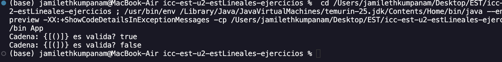
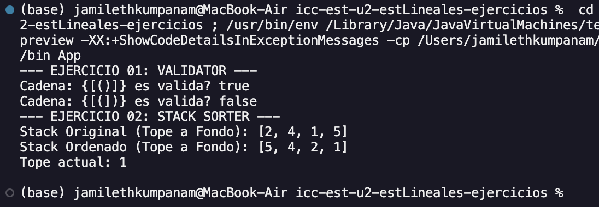
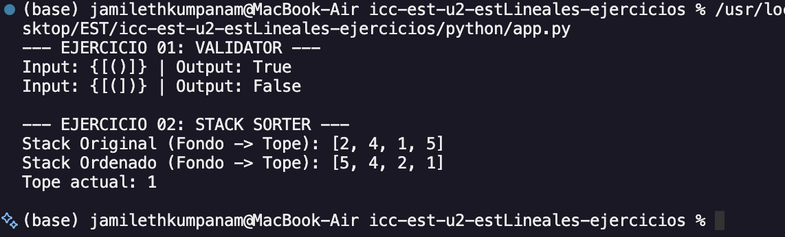
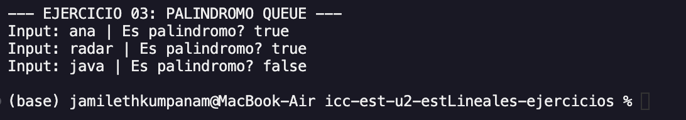
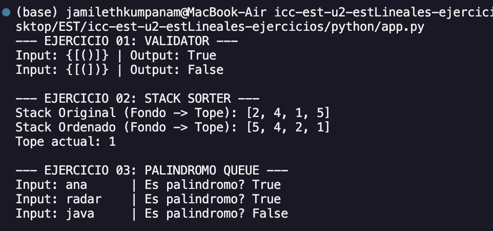

# Estructura de Datos

--
### **Asignatura:** Estructura de Datos
---
# Estudiante:
- Jamileth Estefania Kumpanam Segarra - [Enlace a GitHub](https://github.com/jamileth-kumpanam)
## Práctica: Estructuras de Datos Lineales

Este proyecto implementa soluciones para tres problemas clásicos de estructuras de datos lineales (Stacks y Queues), demostrando el uso de validaciones, ordenamiento y manipulación de estructuras FIFO/LIFO tanto en Java como en Python.

### Tabla de Contenidos

- Ejercicio 01: Validación de Signos

- Ejercicio 02: Ordenar un Stack

- Ejercicio 03: Palíndromo usando Colas

- Ejecución

## Ejercicio 01: Validación de Signos
- ### Descripción
El objetivo es determinar si una cadena de texto que contiene los caracteres ( ) { } [ ] está correctamente balanceada. Todo símbolo de apertura debe cerrarse en el orden correcto y con su tipo correspondiente.
- ### Lógica de la Solución (Stack)
Se utiliza una estructura de pila (Stack) debido a su naturaleza LIFO (Last In, First Out):

1.  Se recorre la cadena carácter por carácter.

2. Si el carácter es de apertura ((, {, [), se inserta (push) en la pila.

3. Si el carácter es de cierre (}, ], )):

    - Se verifica que la pila no esté vacía.

    - Se extrae el tope de la pila (pop) y se comprueba si hace pareja con el carácter actual.

4. Al finalizar, la cadena es válida solo si la pila está totalmente vacía.

- ### Evidencia de Ejecución
    - #### Salida esperada: 
        Identificación correcta de cadenas válidas como {[()]} y cadenas inválidas como {[(])}.

## Ejercicio 02: Ordenar un Stack
- ### Descripción
El objetivo es ordenar un Stack de enteros de tal manera que los elementos más pequeños queden en el tope, utilizando únicamente un Stack auxiliar y operaciones permitidas (push, pop, peek, isEmpty).
- ### Lógica de la Solución (Two Stacks)
Se implementa un algoritmo de ordenamiento utilizando un stack auxiliar (auxStack):

1. Se extrae un elemento (temp) del stack original.

2. Se compara temp con el tope del auxStack.

3. Mientras el tope de auxStack sea mayor que temp, movemos elementos de auxStack de regreso al original. Esto garantiza que en auxStack los elementos queden ordenados temporalmente con el mayor en el tope.

4. Se inserta temp en auxStack.

5. Finalmente, se vuelcan todos los elementos de auxStack al original. Al invertir el orden, el stack original queda con los elementos menores en el tope.

- ### Evidencia de Ejecución
    - #### Salida esperada: 
        Salida esperada: El stack original [2, 4, 1, 5] se transforma para que al hacer pop salgan en orden: 1, 2, 4, 5.

## Ejercicio 03: Palíndromo usando Colas
- ### Descripción
Determinar si una palabra es un palíndromo utilizando únicamente Colas (Queues). No se permite la comparación directa de cadenas ni el uso de Stacks para invertir.
- ### Lógica de la Solución (Double Queue)
Se aprovecha el comportamiento FIFO (First In, First Out):

1. Se llena una colaOriginal con los caracteres del texto.

2. Se construye una colaInvertida. Como las colas insertan al final, para invertir el orden se utiliza una cola auxiliar:

    - Para cada nuevo carácter, se inserta en la cola auxiliar vacía.

    - Luego, se mueven todos los elementos de la colaInvertida actual detrás del nuevo carácter en la auxiliar.

    - La auxiliar pasa a ser la nueva colaInvertida.

3. Se extraen y comparan elementos de ambas colas simultáneamente. Si todos coinciden, es un palíndromo.

- ### Evidencia de Ejecución
    - #### Salida esperada:
    ana y radar retornan true, mientras que java retorna false.
    
    
